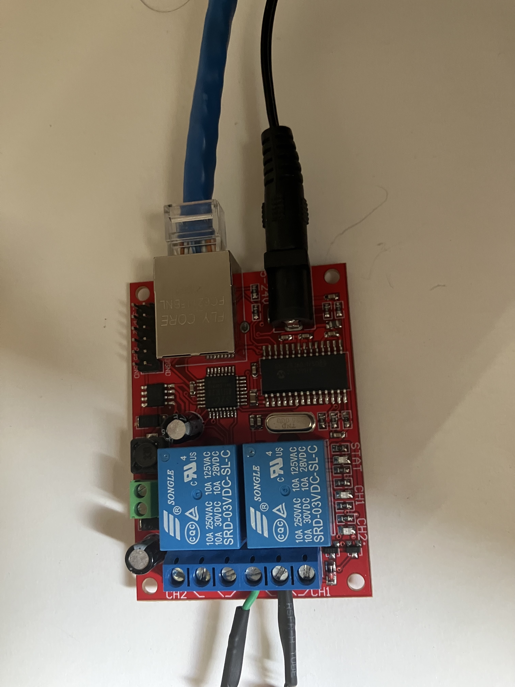

# configuration

    echo -n "#29876,<set_ip>;" | nc <ip> 5111
    echo -n "#39876,<subnet>;" | nc <ip> 5111
    echo -n "#49876,<gateway>;" | nc <ip> 5111
    echo -n "#89876,<dns>;" | nc <ip> 5111
    echo -n "#79876;" | nc <ip> 5111

see [sr201 wiki](/cryxli/sr201/wiki)
