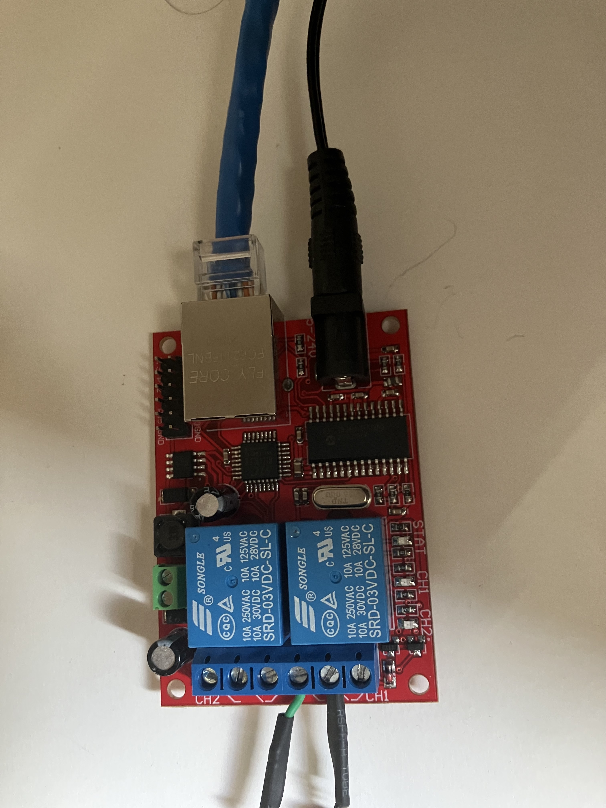
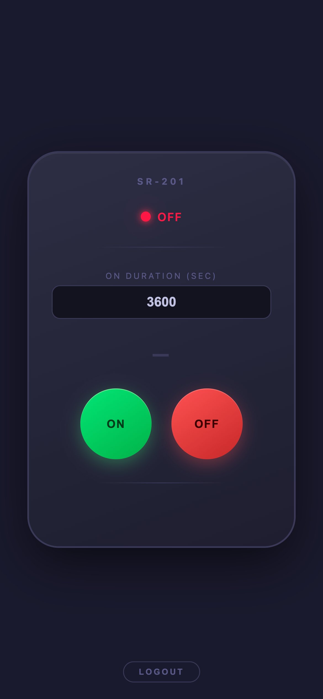

# iot-sr201

Remote relay control for the SR-201 module via a Cloudflare Worker and a local Go bridge daemon.




## Architecture

```
Browser / PWA
     │  HTTPS
     ▼
Cloudflare Worker          (src/worker.js)
     │  VPC service binding
     ▼
Bridge daemon              (_bridge/bridge.go)  :8080
     │  TCP
     ▼
SR-201 relay module                             :6722
```

The Worker handles authentication and exposes the public API. The bridge daemon runs on a local machine on the same network as the SR-201 and forwards commands over TCP. Cloudflare's VPC service binding connects the two without exposing the bridge to the internet.

## Components

### Cloudflare Worker

Handles three endpoints:

| Method | Path      | Auth            | Description                        |
|--------|-----------|-----------------|------------------------------------|
| POST   | `/login`  | Password        | Returns a signed JWT (30-day TTL)  |
| POST   | `/bridge` | Bearer JWT      | Sends a relay command              |
| GET    | `/ws`     | `?token=<jwt>`  | WebSocket proxy to bridge daemon   |

**`POST /login`**

```json
{ "password": "<PASSWORD>" }
```

Returns:

```json
{ "token": "<jwt>" }
```

**`POST /bridge`**

```json
{ "seconds": 30 }
```

`seconds > 0` turns the relay on for that duration; `seconds = 0` turns it off immediately.

### Bridge Daemon

A Go HTTP server that listens on `:8080` and forwards commands to the SR-201 over TCP. Requests must include the `x-internal-secret` header (set automatically by the Worker).

Build and install:

```sh
cd _bridge
go build -o bridge .
sudo cp bridge /usr/local/bin/bridge
```

Install as a systemd service:

```sh
sudo cp bridge.service /etc/systemd/system/bridge.service
sudo systemctl daemon-reload
sudo systemctl enable --now bridge
```

## Deployment

### Secrets

Set the following secrets via the Wrangler CLI (never commit these):

```sh
wrangler secret put PASSWORD    # login password
wrangler secret put JWT_SECRET  # HS256 signing key
```

### Deploy

```sh
wrangler deploy
```

## SR-201 Network Configuration

Send configuration commands to the module over TCP on port 5111:

```sh
echo -n "#29876,<ip>;"      | nc <current_ip> 5111   # set IP address
echo -n "#39876,<subnet>;"  | nc <current_ip> 5111   # set subnet mask
echo -n "#49876,<gateway>;" | nc <current_ip> 5111   # set gateway
echo -n "#89876,<dns>;"     | nc <current_ip> 5111   # set DNS server
echo -n "#79876;"           | nc <current_ip> 5111   # save and restart
```

See the [SR-201 wiki](https://github.com/cryxli/sr201/wiki) for the full command reference.
